Gary Dyrkacz, Oct, 2020

 **Introduction**

With an interest in using an Arduino Uno and an HC-SR04 ultrasonic
sensor, I found myself confused by some of the information available on
the HC-SR04 ultrasonic sensor. Some confusion was due to my novice
status to sensors, the Arduino, and ultrasonics, but some posts and
reports online left me uneasy on the characteristics and limitations of
the ultrasonic sensor to predict a projects success or failure. This
report is a start to answering some details on the detection of certain
sizes of objects, materials, and the angles that they could be detected
at. In the end, the work answered some of my own questions, and
reinforced some information already available. However, the work raised
more questions that showed a more focused approach is needed regarding
the sensor, which can only be answered with more detailed tests. The
result is the following experiments and discussion provide some skeleton
framework on what to expect and the direction for more experiments.

The first and most confusing HC-SR04 characteristic that prompted my
skepticism was the following diagram, or versions of it:

> 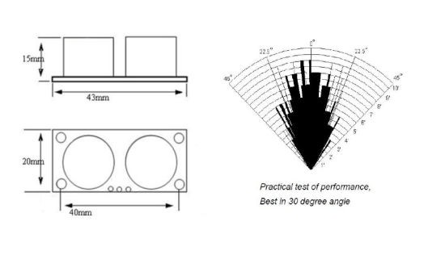
> 
>  

This image of the angle performance is ubiquitous in manuals on the
specifications of the HC-SR04 from just about every sensor module
seller, but I was unable to identify the originator of the data, or just
how this data was generated. Even professional journal articles use a
copy of the "practical test of performance" plot, without referencing
the original producer.

How this beam angle data was measured and what the target material was,
is misleading without the details of how the data was generated. The
average half angle of detection is around 20 degrees. However, as I
found by reading and from my own tests, using an average with an
ultrasonic transducer is not necessarily a good measure of a sensor's
sound pressure or sound energy beam detection pattern. Clearly, the
detection performance angle changes substantially from the centerline as
the distance increases out to the maximum of approximately 9 feet (2.74
m); this distance is well within the maximum range of the sensor, which
in many cases with a large, good reflecting target may be up to 4-6
meters.

There are many reasons for the lack of a smooth performance shape and
drop off with distance:

1\. The sound pressure (measured in decibels , dB) transmission pattern
out of the emitting transducer is not necessarily a smooth envelope, but
often consists of lobes, with the central lobe the most sensitive (most
sound energy) for distance. The lack of a smooth envelope for the
performance pattern could be displaying some aspect of the lobe
patterns.

2\. Distance from emitter transducer and back to microphone transducer.
Sound pressure decreases as the inverse of distance, but is more
complicated because of reason 1.

3\. Sound energy absorption by the air has a big effect. (For example,
ref (1):
<https://www.acs.psu.edu/drussell/Demos/Absorption/Absorption.html>) 

4\. Just how "practical" was the test, relative to a target material?
Was the material a painted wall, a metal plate, a sheet of wood or
plastic, round or flat? How smooth was the surface?

5\. We all seem to assume that this pattern was measured as echoes off
of some surface, using the microphone pickup of the HC-SR04. Because the
diagram is labeled as a "practical" performance test; it would seem to
be a safe assumption, but we have no direct statement of that
assumption.

6\. Assuming the safe assumption in item 5, a bigger issue is how was
the target material placed with respect to the microphone? Was the
target always kept horizontal to the sensor centerline, or was the
target "aimed" at the microphone to maximize sound energy return to the
sensor? Later, I will discuss this issue in more detail. All these
questions affect the practical performance.

Much later and after I had done the tests described here, a dedicated
search turned up a better idea of the target detection performance of an
HC-SR04. the Parallax
[PING)))](https://www.parallax.com/sites/default/files/downloads/28015-PING-Sensor-Product-Guide-v2.0.pdf)
Ultrasonic Distance Sensor appears to be very similar to most HC-SR04
sensors. The product guide for the Parallax
[PING)))](https://www.parallax.com/sites/default/files/downloads/28015-PING-Sensor-Product-Guide-v2.0.pdf)
Ultrasonic Distance Sensor, ref
(2)

[https://www.parallax.com/sites/default/files/downloads/28015-PING-Sensor-Product-Guide-v2.0.](https://www.parallax.com/sites/default/files/downloads/28015-PING-Sensor-Product-Guide-v2.0.pdf)pdf
displays the results of two kinds of tests. In one test, it shows a
similar pattern to the above, and moreover, specifies the target was a
3.5" dia. cylinder (material unspecified) that was moved laterally from
an imaginary centerline from the sensor, to find the detection point at
various distances. The beam spread detection point in this case was ~25⁰
up to 24" ((61 cm), then decreased to a fairly constant angle of 20⁰,
which rapidly dropped off after 5.5 ft (166 cm) to no detection by 7.5
ft (229 cm). This type of detection, I will refer to as "aimed"
detection. It maximizes at any distance the potential for target
detection. The Parallax data thus supports a notion that the first image
was generated with some sort of aimed target, either intentionally, or
as a result of target shape.

Parallax also went a step further, and performed detections where the
target surface was kept normal to the centerline from the sensor; a
cardboard target was maintained always parallel to the PCB board of the
sensor. In this case, the beam spread, starting at 12 inches was ~30⁰
from the origin, decreasing rapidly to 10⁰ at 45 inches. From the
drawings of reflection angles, it appears the centerline was taken as
coincident with the center of the emitter transducer, with the origin
point at the PCB board. (I will show a plot of this data later.)

**Some Previous Work**

I am not alone in wondering about the details and limitations of the
sensor. I will mention a few that I found, and I deem important in
guiding my approach to the issues. 

This study ref (3),
<http://www.fadstoobsessions.com/Learning-Electronics/Component-Testing/HC-SR04-Ultrasonic-Ranging.php>
I found very interesting. A cardboard target was mounted on a tripod.
The cardboard target was moved laterally, i.e., normal to the imaginary
HC-SR04 centerline, inward to find the edge of detection. Note that the
term "centerline" is the imaginary normal (90⁰) axis to the PCB board of
the sensor. Between different tests, the centerline horizontal position
may be different, but in just about every case, the target vertical
center is in line with the centerline. The cardboard was held normal to
the centerline of the sensor, which would be parallel to the sensor's
PCB board. (I will use "normal" in this sense, throughout this
discussion.) The distances from the sensor, and laterally to the
centerline, were then measured. Here are the results from that work:

 

> 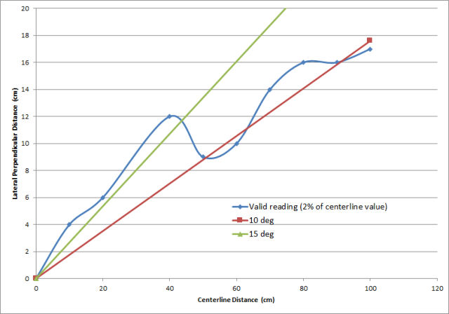

*Figure* *1 Lateral Distance versus Centerline distance from reference.*

The plot consists of the distance along the centerline from the sensor,
and to the centerline from first detection. The lines are where the
tangent lines for 10⁰ and 15⁰ would be, which is easily calculated from
the 2 distances. Note how the range is wider at close distances, and
drops off rapidly after 40 cm (15.748 in). There is another drop off at
about 30". The undulating variation of angle is likely evidence of
multiple lobes. Also, note that over even 1 meter, the beam appears to
quickly tighten up the detection angle, suggesting a higher energy
centerline lobe.

 

As in the Ping))) case, the lobes should mean I would detect something
further off angle at close distances, and detection would drop off at
high ranges.

 I found this, ref(4)
[https://www.google.com/url?sa=t\&rct=j\&q=\&esrc=s\&source=web\&cd=11\&ved=2ahUKEwj49-fCkZDnAhUCK80KHdzqCAMQFjAKegQIARAB\&url=https%3A%2F%2Fwww.mindmeister.com%2Fgeneric\_files%2Fget\_file%2F7925113%3Ffiletype%3Dattachment\_file\&usg=AOvVaw09COP-u\_3QpDvCgfX73zyv](https://www.google.com/url?sa=t&rct=j&q=&esrc=s&source=web&cd=11&ved=2ahUKEwj49-fCkZDnAhUCK80KHdzqCAMQFjAKegQIARAB&url=https%3A%2F%2Fwww.mindmeister.com%2Fgeneric_files%2Fget_file%2F7925113%3Ffiletype%3Dattachment_file&usg=AOvVaw09COP-u_3QpDvCgfX73zyv)
as a PowerPoint presentation.

Relevant conclusions, but with no supporting evidence:

  - Detection could be 45⁰ from centerline at up to 1 meter.

  - Even a pen could be picked up at 30 cm on the centerline.

  - At maximum distances, 3 m, the area of detection is 15⁰, and target
    angle is critical, with no other object in the area.

ref (5):
[https://app.box.com/s/4nafz9scusuk4kq1628u](https://app.box.com/s/4nafz9scusuk4kq1628u)
is some very detailed work on framing the specifications of an
ultrasonic sensor. I have some concern because especially at longer
distances, the targets and sensor were near floor level, and some bounce
off the floor might have been picked up. The authors goal was to
investigate the precision and accuracy of distance measurements, but
some of his findings were relevant to the current project. More detail
and files can be found in this discussion ref(6):
[https://forum.arduino.cc/index.php?topic=243076.0](https://forum.arduino.cc/index.php?topic=243076.0)

> The conclusions drawn for this work were:

1.  The best measurement results are obtained by reflection on smooth,
    flat surfaces.

2.  For distances up to 1 m, the surface material of surface is not
    critical.

3.  Over short distances, of less than 1 m, the angle to the object can
    reach up to 45°.

4.  Even quite thin objects are reliably detected. A normal pen, for
    example, can be detected at a distance of about 30cm.

5.  At maximum distance (3 m) the object must be exact targeted and
    there should be no other object in the area (similar distance) in a
    emission cone of 15 °.

6.  Supposed accuracy is 3 mm widely quoted.

7.  FOV (full cone): horizontal ~20⁰, vertical ~13⁰

In comparison to what I found below, I question conclusion number 2.
Cloth, especially a loose weave will not show up at all. Even skin is
iffy, unless very near the sensor.

As a useful aside, an equation for the speed of sound in air was given
as *331.5 + 0.6\*T(⁰C)*. There are numerous cases online where this
formula is used. it works quite well, and is within 0.5% of the best
values, even though it does not take into account variation with
relative humidity or air pressure. In the most common temperature and
humidity range during mid-latitude summers, the values are almost spot
on. Very accurate predictive equations derived from experimental data
are available. From those accurate results and the fitting equation that
was derived, I put together a less complicated linear equation than from
the original 16 term equation that takes into account temperature,
relative humidity, and air pressure. Of course, the equation is a less
accurate than the original, but is more accurate than the simple formula
above, especially at low or elevated temperature and humidity
conditions. It could be argued that more accurate equations are overkill
with an HC-SR04. (See the ultrasonic programmable LED parking project in
this repository, references therein. See the Excel file for speed of
sound versus temp and humidity:

*Sound\_velocity\_T\_RH\_Calculator.xlsm* calculates a reduced equation,
based on the most accurate sound velocity data correlation in 1993. See
the vba module code.

**Experimental Setup and Process**

To better frame out the characteristics of the HC-SR04, two types of
experiments were performed. In one case, at predetermined distances, a
flat target was placed with the face set perpendicular to the sensor
imaginary normal centerline. The sensor was then swept in 1 degree
increments back and forth across the target. This is designated as the
sweep or "aimed" experiments.

In the second experiment, the servo was locked at 90 degrees, which is
0⁰ relative to the normal centerline. At predetermined distances, the
target was manually moved back and forth laterally in small increments,
to bracket the point at which the sensor registered the correct
distance. These are designated as static experiments.

Both experiments used only one sensor, though a cursory check with a
second sensor seemed to correlate reasonably well with the detailed
results presented here.

In all experiments, whatever the size of the target, the center of the
target was maintained coincident with the imaginary centerline vertical
height with the vertical center height of the sensor emitter transducer
and microphone. The targets were all aligned with the long side
vertical.

Independent distance measurements were provided by a tape measure, which
was perpendicular to, and coincident with the midpoint between the
transmitter and microphone cones, and measured from the PCB board of the
sensor. The centerline is defined as the imaginary axis perpendicular to
the PCB board, vertically coincident with the center of the cones and
horizontally coincident with the middle of the PCB board, which also is
the midpoint between the two sensor cones. All measured values were
within 2-3 mm of correct position, i.e., 3/16". All targets were checked
to ensure they were vertically perpendicular to the floor with an
electronic table saw angle detector, accurate to 0.2⁰.

*Targets*

Five targets were used:

1.  Two Dow HP P/P FFF fanfold underlayment insulation panels: 10.5" x
    48"x 0.20" (26.7 x 122x0.53 cm) and 24"x 48" (61 x 122); sheet
    thickness is 0.21" (5.3 mm). This specific underlayment has a thin,
    smooth plastic coating on both sides, giving it more rigidity, and
    for the purposes here, a better sound reflectance. The larger sheet
    of underlayment was only used for the static measurements.

2.  A 1" wide, steel yardstick.

3.  A 12" x 23" (38.5 x 58.4 cm); 0.027" (23 gauge) aluminum sheet (will
    use the element symbol - Al).

4.  A 1 5/16" x 1 1/2" (3.3 x 3.8 cm) aluminum piece cut from a flat
    piece of roof flashing.

*Sensor Sweep Measurements*

With the exception of the small aluminum target, all the targets were
mounted in a simple vice like pedestal rigged from several of blocks of
wood and a couple of clamps. Additionally, the large aluminum sheet and
mount were placed on a step stool; the bottom of the sheet started
approximately 18" from the floor and therefore topped out at 41"; this
insured the Al sheet was vertically centered on the sensor. The
yardstick was mounted like the underlayment, with a total vertical
exposure of 34". The maximum detection distance point at 0⁰ for the
yardstick was not determined from a sweep measurement. It was determined
in a later measurement, where the yardstick was moved along the
centerline until no echo was detected. In all cases, the entire pedestal
was covered with loose terrycloth, to minimize any reflections from the
supporting base itself. The underlayment sheets were further stabilized
with the steel yardstick taped to the back of the panels.

The 1 / 5/16 "x 1 1/2" aluminum sheet was mounted differently, suspended
from a cantilever arrangement. Long aluminum screen frame stock was
attached horizontally to a vertical support outside the anticipated
sensor field. The target was suspended from the screen frame stock ~6 ft
off the ground, by two threads taped to the back of the target. A third
thread was suspended from the framing stock and centered on the target;
this thread acted both as a damper to quickly kill any oscillations of
the target, and provided a means to pinpoint the distance measurement on
the tape measure on the floor. The thread was heavy weight shoe
stitching thread, which was found to not trigger any reading. Below are
several photos which should help understand the arrangement. (The setup
of the large Al sheet is not
shown.)

| 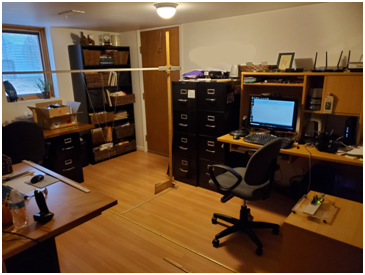                                                      | 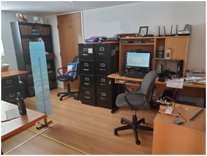 |
| -------------------------------------------------------------------------------------------------- | ------------------------------------------- |
| 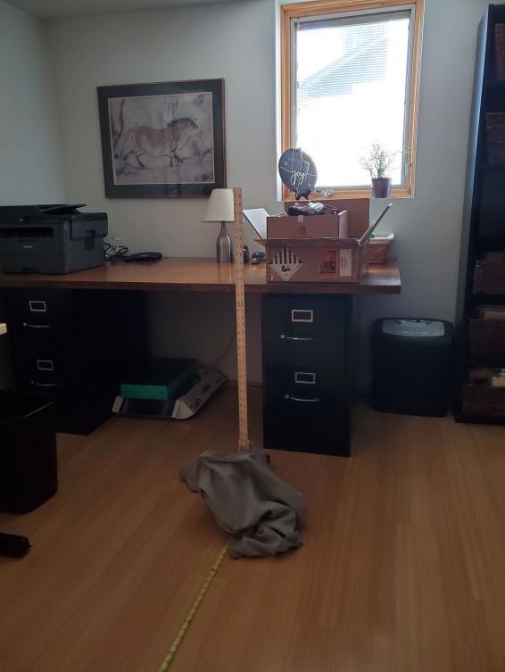 |                                             |

 

The first photo shows the simple cantilever arrangement for the small Al
flashing target; the second photo shows the mount for the smaller
underlayment panel, and the last photo shows the mounted steel rule. The
maximum range that a target could be moved was 109" (277 cm). In the
second photo, the steel rule used as a stabilizer and support for the
underlayment panel is visible through backlighting.

The first and second photo also show the Arduino and sensor mounted on a
cabinet with center of the cones 30.5" above the floor . The temperature
and humidity were monitored at the beginning and end of the procedure.
and varied about 2 ⁰F, 61 - 63.2 ⁰F throughout the experiments. The
relative humidity, Rh, remained constant at 32.1 %.

A typical measurement cycle: Position the target at a specific distance
from the sensor. Ensure that the target face was was normal to the
imaginary centerline of the sensor, and the center of the sheet
horizontally and vertically was coincident with the sensor centerline;
check to make sure the servo mounted sensor was normal to the
centerline; press the button on the breadboard to initiate the sweep
cycle; use CTRL-C to copy the data from the Serial Monitor, and paste it
into an Excel 2007 workbook, adding the distance from the sensor.

*Static sensor measurements*

The 2' x 4' panel used for the static measurements of the detection
envelope, had a very slight bow in the long dimension amounting to no
more than 1/4" deviation from top to bottom of the panel. There was no
horizontal curvature or twist. Errors on horizontal measurements from
the center of the sensor (between the receiver and transmitter cones was
with a steel yard stick are within 1/16". Zero front distance was set to
the plane of the sensor circuit PCB board. At each distance measurement,
the panel was always checked to ensure the panel was parallel with the
sensor PCB board (perpendicular to the centerline). As needed, this was
checked with a large steel square used with the wood floor pattern lines
as base to ensure the target was parallel to the sensor PCB board.
Estimated variation deflection from parallel between the target panel
face and the sensor PCB is less than 2 degrees.

A typical measurement procedure was: Move the panel near the desired
centerline distance from the sensor position, and outside the
anticipated lateral distance from the centerline. Move the panel in
small increments laterally, press the button on the breadboard to
trigger a measurement. Continue to move laterally, from or to the
centerline in fine steps, until a stable distance value near the
measured distance was just located. Use Ctrl-C to copy the data from the
IDE Serial Monitor to an Excel spreadsheet, record the actual final
distance of the panel from the tape measure on the floor, and the
lateral distance from the centerline, coincident with the center point
between the two sensor barrels. In all cases, it was necessary to make a
number of lateral movements in and out of the stable region to bracket
the optimum lateral distance . Generally, variation of the optimum
position values was estimated as within 1 cm. This is tedious work,
requiring many hours to accomplish. The temperature and humidity were
the same as for the sweep measurements.

*Arduino Setup and Sensor Hardware Mount*

The HC-SR04 sensor was mounted on a large radio control aircraft servo,
because this type of servo has a high torque value, and are less likely
to be overtaxed by any stiffness in the wires going to the sensor. The
servo was powered separately from a standard 2000 mah, 4.8V flight pack
for two reasons. One, the Arduino could not supply the current needed to
drive the servo, and second, to minimize possible feedback issues from
the servo. The same mount for the sensor, was used in both experiments,
only the sketches differed.

The sensor mount was a DIY special. It consisted of an old Airtronics
servo fitted with a flat wheel type servo horn. Over the circular
plastic horn, a 1/8" lite-ply round plate of the same size was cut out,
and attached with double sided tape. A long arm of 1/8" lite-ply was
then attached with double sided tape to the horn lite-ply. The reason
for the lite-ply plate was because it provided greater stability to hold
the long sensor vice mount with double sided tape, compared to the just
the lite-ply arm on the plastic plate. A hole was also drilled in the
center of the long arm and the round plate so that the servo arm
mounting screw could be accessed for positioning to the correct starting
angle. On the lite-ply arm, two homemade Plexiglas movable right angle
vise-like brackets were mounted, as a "vise" to rigidly hold the sensor
board.

Although overkill information for many, here is how the two L-shaped
plastic vise mounts was made: The vertical arms of the Plexiglas holders
had V-shaped groves filed into them to rigidly hold the sensor board.
The horizontal arms were made from scrap plastic 1/4" sheet that had
been run through a table saw with a fine blade to make a slot wide, and
deep enough to fit the head of a 4-40 Allen head screw flush with the
top surface. The arms were then cut from the sheet into a 1/2" wide
strip, and the groove and edges sanded smooth. Through the middle of the
slot, a series of holes were drilled to just allow the 4-40 machine
screw to pass through. The holes were then filed into a long open slot.
The long lite-ply arm fitted to the servo was then drilled, and the 4-40
screws screwed in to self tap the lite-ply. (This was sufficient for
this case, but "T" nuts could have been used if the lite-ply threads
stripped out.) Finally, the arms of each bracket were epoxied together
at right angles to make right angle brackets.

The reason for making an adjustable holder was that it could be used to
mount other sized sensors as needed.

The sensor was locked between the brackets, situated so that the sensor
PCB board was directly over the servo arm mounting screw and each sound
cone was equidistant from the mounting screw. The servo was mounted in a
common servo mounting plate used in Radio Control aircraft, which was
then screwed to two wood blocks as "legs". (Another hobby to the
rescue.) The servo horn assembly was then adjusted to the servo motor
tines to be as close as possible to be parallel to the edge of the large
clear plastic baseplate mount holding the Uno and the breadboard, which
in turn, was adjusted to be perpendicular to wooden floor board pattern.

The images below provide reference for the detailed description
above.

|                                                                             |                                                                     |
| --------------------------------------------------------------------------- | ------------------------------------------------------------------- |
| 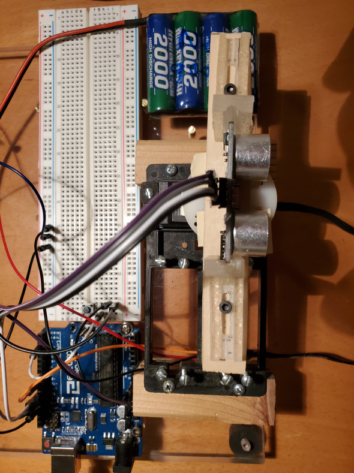 | 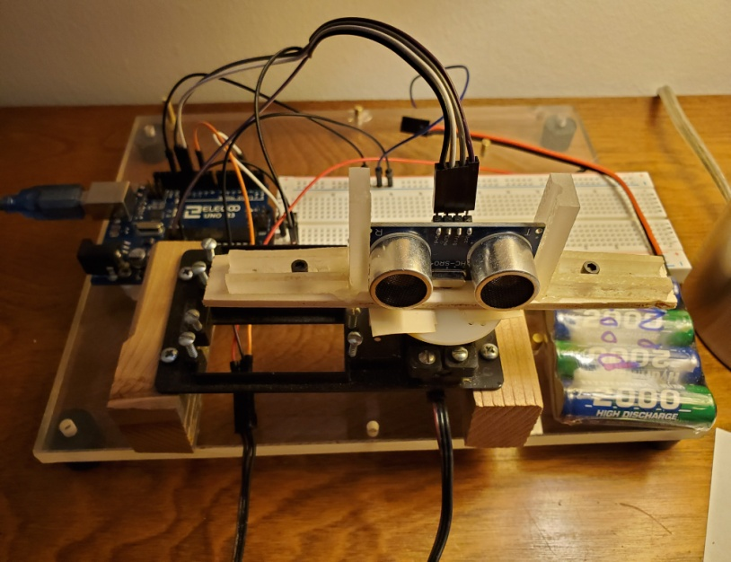 |

The Arduino Uno R3 operated the servo and HC-SR04 sensor. A pushbutton
switch was added to act as trigger to start data
acquisition.

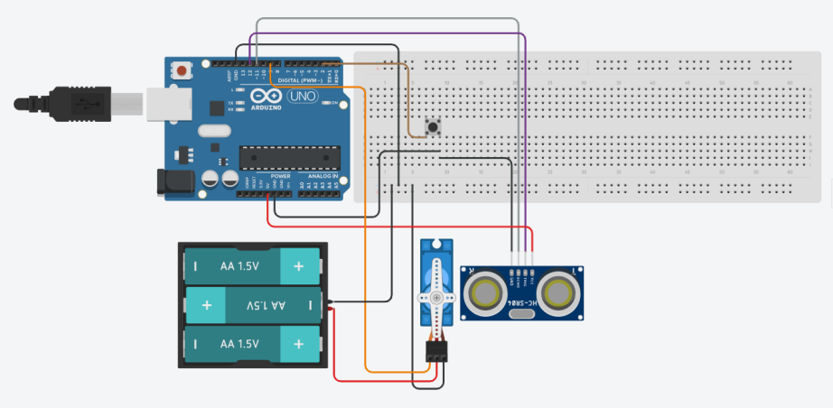

Connections

| **Arduino pin **                | **Sensor/Btn/Servo Pin **                                                |
| ------------------------------- | ------------------------------------------------------------------------ |
| 5V Analog                       | VCC HC-SR04                                                              |
| 12                              | TRIG HC-SR04                                                             |
| 11                              | ECHO HC-SR04                                                             |
| GND Analog side                 | HC-SR04 GND                                                              |
| **Button setup**                |                                                                          |
| GND Analog side                 | Side A; common with HC-SR04 GND common on breadboard                     |
| 2                               | Side B; MUST SET SKETCH FOR INTERNAL PULLUP RESISTOR VIA "INPUT\_PULLUP" |
| **Servo Setup**                 |                                                                          |
| 9                               | Servo signal Pin 3 for older Airtronics                                  |
| to Arduino GND Digital          | Servo GND to breadboard with 4.8V Battery GND +                          |
|                                 | Servo Pin 1 to 4.8V battery red wire (+)                                 |
| GND Digital through breadboard. | Servo Pin 2 to 4.8V battery black wire (-), + GND common on b breadboard |

The schematic shows the sensor is separate, but as depicted in the
images, it is mounted on the servo.

*Arduino Uno Sensor sketches*

The Arduino sketches were all run using the Arduino IDE under Windows
10. Excel 2007 was used to process and visualize the data.

None of the sketches have any surprises for those familiar with sketches
for the ultrasonic sensor, or a servo. The sketch for sweeping the
angles was: *unsonic\_servo\_sweep.ino.*

The sketch does two sweeps when the button on the breadboard is pressed,
moving in 1 degree increments from 20 to 160 degrees, and from 160 to 20
degrees in 1 degree decrements. In this case, the reference point, or
centerline through the middle of the sensor board is at 90 degrees,
which is servo dead center. However, all angle measurements discussed
here are referenced to the centerline as 0 degrees (90 degrees was added
or subtracted in Excel from the actual recorded values). At each degree
step, five measurements are averaged, and the angle, microseconds, cm
distance, and inches distance data were sent to the Serial Monitor of
the Arduino IDE (see sketch). The sound velocity was set to 0.03402
cm/μsec for the distance conversions, which is lower than the better
value later calculated value of 0.034445 cm/μs. The discrepancy is due
to using an online sketch example, in the early stages of the project,
before realizing that more exact sound velocity relationships existed,
This would amount to a difference of 0.0012 cm/μs or 1.6 cm at the
maximum distance of less than 0.4%. Data was transferred from the
Arduino IDE Serial Monitor using *Ctrl-C* to copy the data, and then
pasted to an Excel workbook.

A different sketch was used for the static measurements. The sensor
assembly, or rather the servo was set to 90 degrees using the sketch,
*sevo\_90\_calibration\_btn.ino*. A second sketch,
*usonic\_static\_btn.ino*, was then loaded to get the echo data, which
averaged 5 echoes and output the distance in cm to the Serial Monitor.
When a stable reading was found, the distance from the sensor and
lateral distance from the centerline were measured and recorded.

**Results and Discussion **

Two different types of experiments were done, because as described in
the Introduction, the angle the target makes with the sensor transducer
and microphone will impact the detection beam or cone. In the first
case, a servo swept the ultrasonic sensor over a centrally placed static
target at 1⁰ increments, and placed specific distances from the sensor.
Five echoes were averaged and output to the Arduino IDE Serial Monitor.
When both a 160⁰-20 ⁰ and a 20⁰-160⁰ sweep cycle were completed, the
data stream was manually copied to an Excel worksheet for analysis.
These are "aimed" or sweep experiments.

For the second tests, the HC-SR04 was held constant, and a target was
moved laterally and maintained normal to the imaginary centerline of the
sensor, while moving it toward the centerline, until the sensor just
registered a stable echo. These experiments are called the static
experiments, because the sensor was not moving.

One important point about the measurements is that 2D fan-like,
detection patterns are displayed, for what is really a set of 3D sound
lobes (rings) of detection. Any target has to intersect enough area of
the beam cone at a specific angle and distance to trigger a valid echo.
None of the experiments here measured the vertical detection pattern.
Reference (6) in the **Previous Work Section** indicates a horizontal
range of 20⁰, and a vertical of 13⁰, which would suggest a somewhat
flattened vertically non symmetric cone. However, the referenced
information does not show the pattern as a function of distance, which
is likely to change with distance.

 

Sweeping the ultrasonic sensor back and forth provides one type of
measurement of the detection angle. In this case, the target is aimed at
the sensor to find the optimum angle and a certain distance to send
maximum sound energy back to the sensor microphone. it does not matter
whether we vary the target angle or sensor angle. The difference is the
frame of reference, but the conclusions will be the same. The graphic
below shows how the two types of measurements will lead to different
detection envelopes.

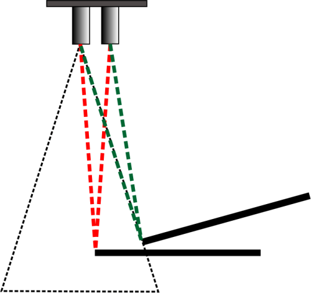

*Figure* *2. Dependence of Detection on Angle.*

The black dotted triangle represents the transducers output that would
represent the cone of sound energy that would trigger a positive target
distance. The red dotted line represents a transmitted and echoed wave
path that would

trigger a positive echo reading for the target maintained normal to the
centerline, while the green line represents the first detection point
for the target angled, or aimed at the sensor. The target position in
the first case, is much closer to the sensor centerline to generate a
response than in the angled target case. Thus, the angle from the sensor
centerline is much smaller when the target is maintained normal to the
centerline, then when it is in the "aimed" target case.

Keep in mind that for the static tests, the detection distances was
measured from the edge of the targets. However, the targets must
transect a sufficient area of the beam to return a sufficiently
energetic echo to be detected. That detection area is not known from the
data here. Moreover, it is very likely that the area changes from point
to point, which will have an impact of the angles. See the last section
of this document for some future tests that the current work suggests as
a path forward.

*HC-SR04 servo sweep measurements*

An example of the raw sensor data as the sensor is swept over the
underlayment target is shown below.

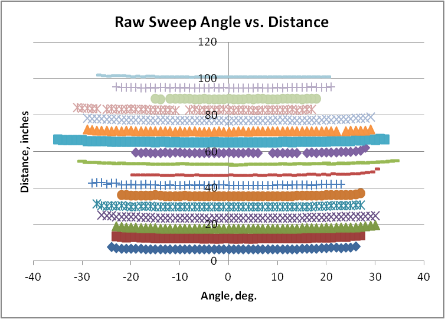

*Figure* *3. Plot a Raw Sweep Data*

This plot only shows the 20-160 degree cycle. The 160-20 degree cycle
shows the same pattern. In practice, other materials in the room also
reflected back to the sensor, giving extraneous readings. These echoes
were easy to eliminate, because the object distance reported by the
sensor were very different than expected, or far outside a reasonable
detection angle. The plotted data has those extraneous echoes removed.

Each of these curves has a slight concave upward pattern, indicating an
increase in distance. This is expected, because the distance to the
target changes slightly depending on the relative angle between the
sensor microphone and the target. It is when the centerline of the
microphone lines up with the normal of the target that the distance is a
minimum.

The critical data are the endpoints of each of these curves. Of some
concern, is that several curves show an asymmetric shift, which might be
real, or suggest some shifting of the sensor initial position. Although
the sensor position was checked repeatedly, it still is possible that, a
small shift in the sensor from its expected position escaped notice. For
each distance, we get four measurements, 2 angles from the left, and 2
from the right. When we take the difference between each absolute
endpoint per cycle, the differences, were all under 5 degrees for the
1/2 angle of the 2 cycle sweep at a certain distance.

Included in these raw endpoint angles is the horizontal width of the
target. We need to remove that distance to determine the true angle at
which the sensor detected the target. We know the width of the target
and the distance from the sensor; the tangent of these values is the
angle that the target itself subtends. Subtracting this from the angle
endpoint measurements, gives us the true angle of detection.

The plot below shows the summary data for the four targets used, with
removal of the target width:

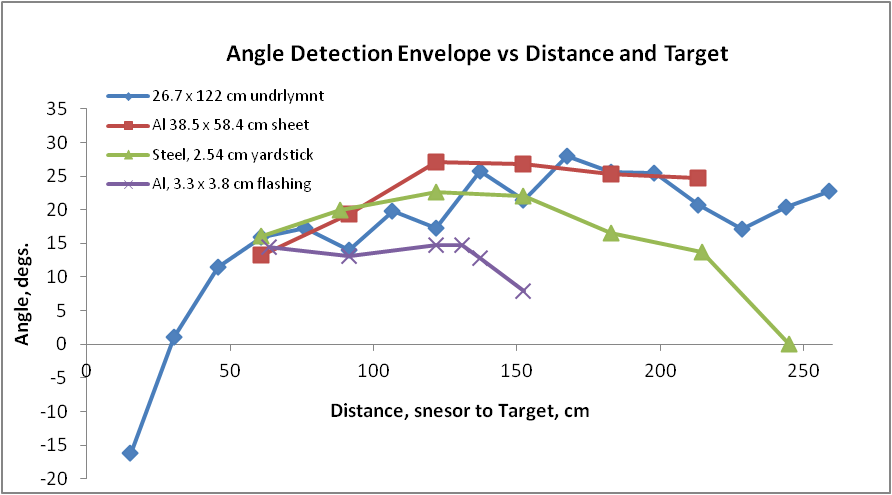

*Figure* *4: Maximum Off-Centerline Angle with "Aimed" Targets*

Of course, the negative angle of -16 degrees at 6" (15 cm) is very
strange. However, at that small a distance. there may be issues with the
very large angle subtended by the target. It is also possible that
echoes are being returned at that distance that are from other than the
near the edge of the target. Despite the probability that we are
measuring something different at these small distances, the data is
reported as is.

Starting at 50 cm, the general trend is a rise in angle of detection,
followed by a decrease. In the range 60-125 cm, with the exception of
the small Al flashing target, the range of slopes is similar for all the
targets, 0.10-0.22⁰/cm, with an average of 0.15⁰/cm, Above 1.25 meters,
the yardstick, drops off in detection distance much faster than the Al
sheet and the underlayment. In the range above 1.25 m, the angle appears
to level out to ~23.5 degrees. Note that In the case of the Al flashing,
the final distance point represents the last point for which a stable
distance reading could be obtained. In the case of the flashing, an
attempt to get a stable reading at 185 cm failed, so the true point
would be somewhere between 152-185 cm. The zero degree value for the
yardstick was defined independently by moving the yardstick at the
centerline to find the point where no echo was triggered. Although the
widths of the Al flashing and the yardstick are similar, the sound field
is a 3D pattern. and therefore, up to some point, the area of the target
is an important component of the detection result. In the case of the
underlayment, the maximum target range distance shown was dictated by
the room size, not a lack of detection.

With a particular target material, the change of the angle is dependent
on three factors. The lobe pattern as a function of distance, the sound
pressure loss as a function of distance, and some fraction of the area
of each target.

The detection pattern displayed by targets indicates that the sound
pressure beam or beam energy is not radially uniform. If it were, we
would expect to see a constant angle at all distances, and at some
distance an abrupt loss of detection. The early increase in angle
indicates that there is one or more high sound energy, high sound
pressure beams or lobes at distances up to about 1.25 meters at a very
wide angle. Within a lobe the sound energy has some maximum and decays
and folds into another lobe toward the centerline, ref (7):
 

*<https://www.fierceelectronics.com/components/choosing-ultrasonic-sensor-for-proximity-or-distance-measurement-part-1-optimizing>
*

The Al flashing and the yardstick are fairly clear indicators of this
complex sound field. We see a rise and then a gradual drop off in angle.
After ~125 cm, the beam pattern is a gradient of sound pressure with
greater energy near the beam centerline. The two larger targets do not
exhibit this drop off behavior, because we have not yet reached the
limits of their detection, which were constrained by the room size and
objects in the room.

With respect to the target area, specular reflection dictates that only
a certain area of the target is involved in reflecting sound back to the
microphone. Diffuse reflection does contribute to this, but much
attenuated.

What is impressive is that even the smallest aluminum target with an
area of only 1.97 in2. (12.5 cm2) could be
detected out to 1.5 m. For the 12" wide Al target, the maximum distance
was limited by the size of the base supporting the sheet. It is not
clear why the underlayment appears to show a higher spread in values. At
this point, based on the other curves, it would not seem be attributed
to issues of different energy lobes emitted by the transducer. However,
the dip observed over 200 cm, is real and likely due to asymmetry in the
beam spread. This will be more clear from the static measurement
results.

 

*HC-SR04 static envelope measurements*

The second set of experiments involved a single 2' x 4' sheet of Dow HP
P/P FFF underlayment. In this case, the underlayment, mounted long edge
vertically, and centered vertically and horizontally on the sensor, was
maintained with the flat face strictly normal to the centerline of the
HC-SR04. At prescribed distances from the sensor, the panel was moved
until it just registered a stable value. The detection edge was refined
by moving the panel back and forth in small increments to bracket the
edge. The distance from the sensor and the distance from the panel edge
to the centerline was then measured, and using the tangent trigonometry
function, the angle was calculated. The data obtained are shown below,

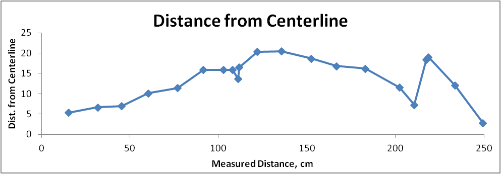

*Figure* *6. Distance Measured from Centerline with Sensor Static and
Target Moved Laterally Normal to Centerline to Find Detection Edge*

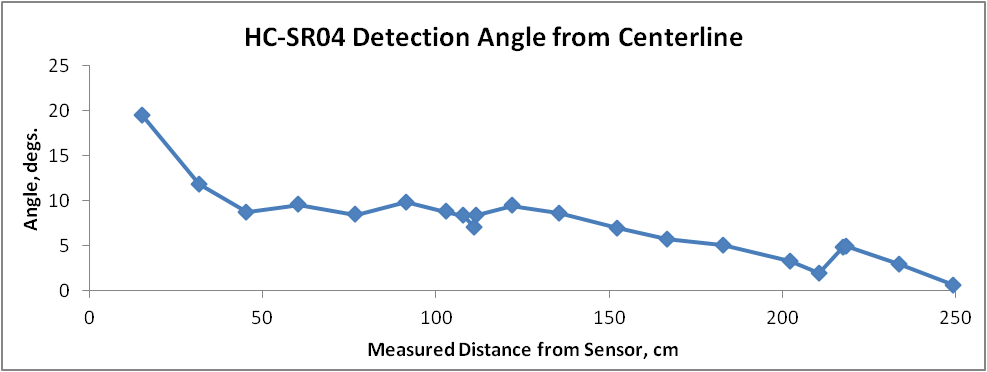

*Figure* *7. Angle Measured from Centerline with Sensor Static and
Target Moved Laterally Normal to Centerline to Find Detection Edge.*

The top plot shows the lateral edge distances measured from the
centerline, and the bottom plot is the angle determined at each measured
point. The dip in the curves at 110 cm is real. There is clearly a very
large drop in beam spread commensurate with target detection up to about
45 cm from the sensor, followed by a slower monotonic decrease,
punctuated by two sharp decreases. The behavior suggests that the sensor
does have a lobed output, which is not surprising for ultrasonic
transducers. What is surprising is just how narrow the beam is at longer
distances. From 45 to 145 cm the angle is ~10⁰ then begins dropping
steadily for the next meter at a rate of ~ 0.06⁰/cm.

With respect to the work represented in Fig. 1 from ref (3), the data
here differ substantially, despite a similar measurement technique. The
distance range studied here was approximately 2.7 times greater, so we
are comparing only the data in the range up to 100 cm. The current
detection in Figs. 6 and 7 show a rapid drop in detection angle of 20⁰
to 9⁰ in the range from 15 to 45 cm, while the Fig. 1 data ref(3) shows
a constant detection angle of ~17⁰ in this same range. After 45 cm, the
two sets of data still differ substantially. The current data show a
relatively constant detection angle of 10⁰, representing a monotonic
increase in lateral distance up to ~130 cm. In contrast, Fig. 1 shows a
very substantial drop in the lateral detection distance, somewhere
between 40-50 cm, with the detection angle dropping to the range
~10-12⁰.

Reconciling these large differences is not straightforward. Both
experiments were performed in a similar manner. The reference point for
zero distance is different, but that only is ~2 cm shift in centerline
distance, which would shift the angle measurements in the present work
to a slightly larger angle. The beam spread data in Fig. 1 were
determined using a 10 cm x 10 cm square target. The target here is many
times larger, although as discussed in the sweep experiments, the area
needed to detect a distance is unclear, and because of beam
heterogeneity may be highly dependent of target size and shape. The
other factor that might influence the results is the target material,
cardboard versus plastic coated foam. I would expect the cardboard, if
uncoated to reflect less energy back to the sensor, but it is doubtful
that the reflectivity would be that dramatically attenuated in the short
range observed in Fig. 1 compared to Fig. 6. Of course, these are
different sensors. However, the ubiquitous nature of the practical
performance plot discussed in the Introduction, that suggests the basic
structure of the transducer and microphone all share the same design
specifications. In conclusion, we cannot resolve with certainty the
reason for the differences in static experiments with absolutely
certainty.

Back to the current experiments, we can compare the underlayment sweep
results with the static experiment results:

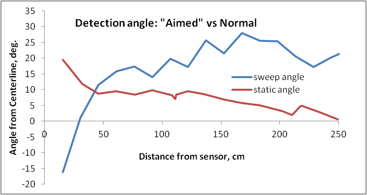

*Figure* *8. Comparison of Target Edge Detection "Aimed" at sensor
versus Target Moved Laterally and Kept Normal to Centerline.*

As expected, the results are dramatically different. Compared to the
commonly found practical performance pattern found on the internet, and
displayed in the Introduction, the sweep data, where the target is
deliberately aimed back at the sensor, more closely follows the pattern.

Another comparison is with data I manually interpolated from the
detection plots shown in the pdf file on the Parallax
[PING)))](https://www.parallax.com/sites/default/files/downloads/28015-PING-Sensor-Product-Guide-v2.0.pdf)
Ultrasonic Distance Sensor ref(2),

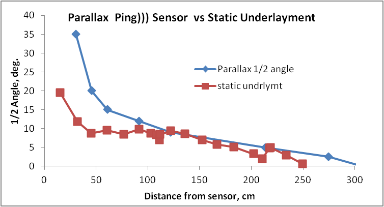

*Figure* *9. Comparison of current HC-SR-04 with Ping)) interpolated
data from ref(2).*

With the exception of the data below 100 cm, the detection angle
envelope is quite similar. Considering these two sensors are not from
the same company, the correlation is quite good. One definite reason for
the difference is the frame of reference for the centerline. From the
Ping))) pdf document, it appeared the centerline was taken as the center
of the emitter transducer, while the measurements here were centered
between the emitter transducer and the microphone pickup. This amounts
to a 15 mm difference, which especially at low angles, will make a
difference in the reported angles. However, a quick calculation shows
that this shift can account for only about 2.5⁰ of the difference. The
target materials, cardboard versus plastic coated underlayment, are also
different, although a naive explanation would suggest that this would
lead to an even wider difference between the two cases. Of course,
neither of these data curves is "wrong", only different in how sensitive
they are to off-centerline horizontal surfaces. Minor differences in
construction and in circuitry may also be involved. (The sweep data
developed here cannot be directly compared with the Parallax Ping)))
data, because the targets are very different, an aimed flat surface,
versus 3.5" cylindrical post.) More useful is that at longer distance,
the two different sensors tend to merge to the same detection sound
pressure dispersion.

As the simple graphic diagram, Figure 2, shows in the Introduction, the
behavior exhibited in each experiment in Fig. 8 is expected. As already
discussed, the sweep data at very close distances, may not be from
echoes related to the center of the target, and are suspect; the
behavior less than 30 cm, therefore, may be a special case.

The usefulness of this data, depends on the intended project. For
distance measurements, off a plane large surface parallel to the PCB
board of the sensor, at large distances the narrow detection angle
clearly dictates that the sensor angle be dead-on to the plane of the
PCB board. Even a few degrees off will give no readings. This narrow
detection angle can be an advantage, if there are other nearby objects,
as long as the object is large enough to return a strong echo. We must
be cognizant of any objects that are far from the centerline that may be
within the detection envelope if their flat surface is "aimed" at the
sensor. The data suggest a lot of caution and attention be used when
fixing the angle between a sensor and target. As a cautionary example,
there is a project listed in my repository that failed, because I did
not pay close enough attention to the findings here.

In conclusion, it appears the original practical beam performance data
was generated most likely with a target aimed at the sensor. More than
likely, this was a large target, without a lot of porosity and surface
roughness. The data here is also consistent with the data indicated by
the Parallax Ping))) detection data.

The sound pressure or sound energy distribution of the beam form the
data here and others appears to be very complicated, and would requires
much more work to fully understand.

After developing the data, it became clear that it would be useful to
understand the relationship between minimum target area and distance,
both off centerline and on centerline that can trigger a detectable,
consistent distance. Unfortunately, the current set of tests, as a
whole, are not designed for this. Because of the obvious non uniform
sound pressure, across the sound field, the minimum target area changes
not only with distance, but laterally as a function of distance as well.
The only case where we can get some idea of the minimum is from the
smallest target, which, at an area of 12.5 cm2, becomes undetectable at
an extrapolated ~170 cm. The only other potential case, the yardstick,
becomes undetectable at 245 cm. However, the actual area detected is not
as clear. At a distance of 215 cm, the last reliable distance
measurement, the sweep detection angle was 13⁰. If we assume, that the
beam energy is distributed uniformly vertically and horizontally, the
detected area of the yardstick at 215 cm would be 126 cm2; this area
must be considered a maximum value, because we do not know if all that
area is effective in returning an echo to the microphone. In terms of a
square target, the Al flashing and yardstick targets would be 3.5 and
11.2 cm squares. If the sound pressure beam is really laterally uniform
a better target representation at the centerline would be a circle, with
diameters, 4.0 and 12.7 cm, respectively.

**Further tests that I am not likely to do, but would be valuable
information. (Science Projects Alert.)**

After analyzing and sweating over the data and its interpretation, it
became clear that much more refined experiments need to be done to
really define the limits of the sensor's characteristics echo
performance. Of course, in hindsight this should have been obvious, and
a much modified approach should have been used. If nothing else, I
learned more than I thought I would ever need to know about the HC-SR04
sensor. Below are the next level of tests that might be done to really
lock down the sensor characteristics:

1\. The objects used in this study are a hodge-podge of "things". It
would be interesting to take a series of materials, e.g., water, soil,
concrete, bricks, cloth (different weaves), painted wall, metal plate,
different porosity plastics, etc. with the same texture, shape, and see
how detection is attenuated, when they are normal to the centerline.
There are really two sets of experiments here. A single size of each
object, and several sizes of a sub set of the objects to get some idea
of how area affects the results. A more clever (fun?) extension for
measurement that requires much more set up, but would allow much faster
data collection in the end, would be to mount the sensor on a rail
system, (model RR track?) and use a stepper motor with a timing belt to
automate the detection process. This is one of those projects that can
go from very simple to very complicated, delving into the mysteries of
sound penetration with depth and density issues.

2\. Clearly, the beam pattern has lobes, which means the energy
distribution at any distance is not a uniform across the 2D detection
angle slice. A refined 3D representation of the beam pattern with
distance would be helpful, especially for targets normal to the sensor
centerline. Mapping this field more precisely as a function of distance
would allow a better understanding for target detection. The few data
points I collected for each experiment set were roughly a half day's
work, with a few specific do over's, and not counting building the
mounts or set up. This is not a quick and dirty task. Detection depends
on the 2D angle from the centerline, the distance from centerline,
target material, shape, and target area. This would be a series of
experiments that build on each other. For instance, a knowledge of the
shape of the field at any distance is necessary. Is it circular or
ellipsoid, or even more complicated, such as bifurcated along the
centerline (doubtful)? Done manually, these are a set of very tedious
experiments, requiring dedicated hours and patience. Of course, some or
a lot of automation is possible. I can think of several ways to use
stepper motors, and model RR tracks or other track mechanisms, to save
time and boredom. At a more advanced level, the entire process could be
handled by sending the serial data from the Arduino to a computer, which
in turn could analyze the data on the fly and send minimal instructions
back to the Arduino to make adjustments to zero in on the detection edge
much faster. There are many algorithms for this kind of idea, e.g.,
simplex optimization, or a Kalman filter. The Python PySerial library
can handle this kind of communication very nicely.

3\. Of course, sensor aimed experiments, where the target is aimed at
the sensor also could be useful. This work puts even more extraordinary
stress on data gathering, because angling the target introduces another
degree of freedom. So these tests are a function of distance from the
sensor, vertical and horizontal position, and target angle to the
sensor. If flat targets are used, this would involve a sketch that
automatically adjusts the target angle in relation to the distance from
the sensor. At first guess, this counter angle problem might be avoided
by using various size spherical targets to probe the practical beam
pressure field. However, because again we need to be concerned about the
effective area that the sphere presents to return an echo, some 3D
geometry calculations need to be considered to determine the effective
echo return area with distance, at any position from the sensor.
